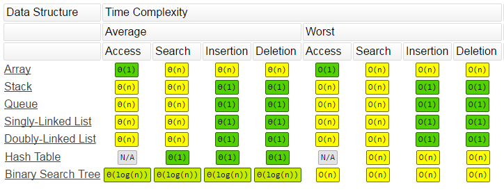

# data_structures

Based on the operations which are most frequently performed in a specific use case / on a given data object, it's important to choose a data structure that is optimized for the given operations.

Some examples:

-   if caching is desired (e.g. because a value is obtained by performing a computationally expensive calculation), then hash map is an ideal structure, providing constant-time (O(1)) lookup of the value
-   if a dataset is used for collecting 1 million new data points per day but is rarely/never searched, then an unsorted array is more performant than a sorted array
-   in contrast, if the above dataset is rarely/never extended with new elements, but is frequently searched, then sorted array is the better choice instead of unsorted array

====================================================================

## Common data structures:

-   **Arrays** (sorted / unsorted)
-   **Linked lists** (singly-linked / doubly-linked)
-   **Stacks** and **Queues**
-   **Hash tables** (i.e. hash map, dictionary)
-   **Trees** (including binary tree, min heap, max heap)

====================================================================

## Data structures and their (average) time complexities:

-   **Unsorted array**

    -   insert: O(1)
    -   search: O(N) - linear search is needed
    -   delete: O(N) - requires searching for the element, deleting it and reindexing the array
    -   find min/max: O(N)

-   **Sorted array**

    -   insert: O(N) - because it needs to be reordered/reindexed (potentially)
    -   search: O(logN) - using binary search
    -   delete: O(N)
    -   find min/max: O(1)

-   **Linked list** (an array-like data structure with its elements identified by their left and/or right neighbors, instead of indices)

    -   insert: O(1) - if tail is maintained (thus the element can be added directly after the tail), otherwise O(N)
    -   search: O(N) - or if it's sorted, then O(logN)
    -   delete: O(1)
    -   find min/max: O(N) - or if it's sorted, then O(1)

-   **Stack** (LIFO) and **Queue** (FIFO)

    -   insert: O(1)
    -   search: O(N)
    -   delete: O(1)

-   **Hash table**

    -   insert: O(1)
    -   search: O(1)
    -   delete: O(1)

-   **Binary tree** (tree-based data structure, with each element having a maximum of two leaves. Concepts: "perfect binary tree" vs "almost complete binary tree")

-   **Heap** (tree-based data structure, is a complete tree, can be binary or n'ary, and the root element is either the max or the min value of the tree, and all subtree-roots are also either the max or min of their subtree)

    -   insert: O(logN)
    -   search: O(N)
    -   find min/max: O(1)

====================================================================

Source: https://www.bigocheatsheet.com/

====================================================================

## Details:

### Array:

-   Collection of elements identified by index or key
-   Array operations:
    -   Access item at index: O(1)
    -   Insert or delete item at beginning: O(n)
    -   Insert or delete item in middle: O(n)
    -   Insert or delete item at end: O(1)

### Linked list:

-   Collection of data elements, called nodes
-   Each node contains whatever data the application needs
-   Each node contains a field that references the next node in the list (the last element references null, indicating the end of the list)
-   Each node might also contain a field that references the previous node in the list (_"doubly linked list"_ instead of _"singly linked list"_)
-   Benefits:
    -   It is fast and easy to add and remove elements from the linked list
    -   Underlying memory doesn't need to be reorganized (because the individual nodes don't have to be stored contiguously, as opposed to the elements in an array)
-   Drawbacks:
    -   Can't do constant-time random item access of any item (arrays can)
    -   Item lookup is linear in time complexity: O(n)

### Stack and Queue:

-   **Stack:**

    -   A collection that supports `push` and `pop` operations.
    -   **LIFO** (Last In First Out) data structure: the last item pushed is the first one popped
    -   Big-O notations:
        -   Pushing an item: O(1)
        -   Popping an item: O(1)
    -   Example usages:
        -   Expression processing
        -   Backtracking (e.g. web browser back stack)
    -   In Python, a list is a stack

-   **Queue:**
    -   A collection that supports adding and removing
    -   **FIFO** (First In First Out) data structure: the first item added is the first one out
    -   Big-O notations:
        -   Enqueue (add) an item: O(1)
        -   Dequeue (remove) an item: O(1)
    -   Example usages:
        -   Order processing (to ensure that orders are fulfilled in the order they are received by the system)
        -   Message processing
    -   In Python, lists aren't queues and thus it is inefficient to use them as if they were. E.g. removing an item from the start would be O(n) time complexity, since all the subsequent items have to be shifted down

### Hash Table:

-   An associative array. Also called a "dictionary" in some languages.
-   It is a data structure that maps keys to their associated values (using a hash function, that also resolves potential collisions)
-   Key-value mappings are unique
-   Hash tables are typically very fast
-   They are ideal for larger datasets. For small datasets, arrays or linked lists are usually more efficient
-   Hash tables don't order entries in a predictable way (the data might be spread out randomly in the system's memory)

## Source / further info:

-   https://www.linkedin.com/learning/programming-foundations-algorithms
-   [Power of Heap](https://www.youtube.com/watch?v=RU08pp_VPSs) by TECH DOSE on YouTube
-   https://www.bigocheatsheet.com/
